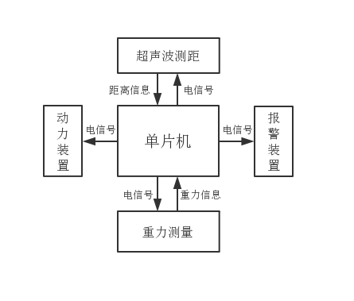
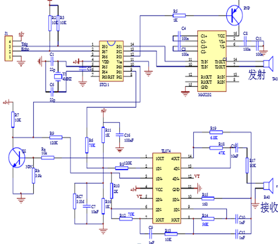
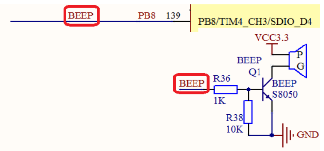
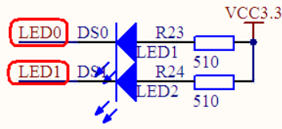
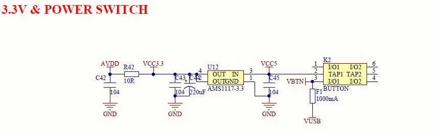

# smart-suitcase
针对行李箱笨重、易丢失的缺点，项目基于STM32设计了一款智慧行李箱。

### 项目简介

针对行李箱笨重、易丢失的缺点，文中基于STM32设计了一款智慧行李箱（暂由智能小车代替）。小车通过超声波测距模块HC-SR04检测主人的距离及方位，并将这些信息送入STM32进行处理，由STM32F103ZET6控制电机驱动模块L298N驱动小车的行进与转向。同时，创新性地引入由FSR402压力传感器、对应电压转换电路组成的重力测量模块，该模块能够实时测量所载物体重量。单片机由AD口与电压转换电路的AO口相接，直接读取重量信息。另一方面，由蜂鸣器和流水灯组成的报警系统能够结合所测的距离、物体重量信息，及时提示主人。目前，小车已经基本实现自动跟随主人的功能，重力测量、报警的功能已完全实现。文中设计的智慧行李箱兼具智能性与安全性，势必会给远行的人们带来极大的便利。

### 项目流程

小车先通过超声波测距测向模块采集主人的距离信息，并通过这些信息进而计算出主人的方向。接着，根据方向信息，单片机会驱动并且控制转向装置，使得小车始终朝着主人的方向前进；而根据距离信息，单片机会调整电机的功率——具体来说，当距离大于一定值时，保持功率不变，让小车匀速行驶；而当距离小于一定值时，就降低电机功率，让小车减速，以免误伤主人。与此同时，单片机不断地对距离信息进行判断，当它超过一定数值时，便同时启动报警装置。另一方面，小车通过重力感应器模块对其装载物品重量进行实时的测量。

性能指标：

- 超声波测距模块的精度为厘米级，在2cm～3m测量精度较高
- 在距离主人0.5m时降低电机功率
- 在距离主人1.5m时启动报警装置
- 重力传感器测量范围是100g~10kg

### 具体模块实现

我们将整个项目分为超声波测距模块、动力装置、报警装置、重力测量模块、供电装置这五个模块，下面是对具体模块的介绍与实现。

#### 超声波测距

本次设计我组选用HC-SR04超声波测距模块，此模块性能稳定，测度距离精确，盲区小。

本模块使用方法简单，只需向TRIG端口发送一个10uS以上的高电平即可触发该模块的启动，该模块内部将发出8个40kHz周期电平并自动检测回波。一旦检测到有回波信号则输出ECHO信号（回响信号）至单片机。回响信号的脉冲宽度与所测的距离成正比。由此通过发射信号到收到的回响信号时间间隔可以计算得到距离。以下为超声波测距模块电路图。

另外，我们将两个超声波传感器相隔距离$d$同向放置，通过超声波测距模块ECHO端高电平持续的时间可以计算出主人与小车之间的距离，再通过下列公式可计算出主人的方位。

$$cos\theta=\frac{x_1^2+d^2-x_2^2}{2x_1d} \tag{1}$$

式中，$x_1$和$x_2$分别表示两个传感器所测量的主人与小车间的距离，$d$为两传感器间距。

尽管超声波测距测量的精度只能达到厘米级，但由于本项目只需根据这个数据计算出主人的大体方向，这个精度对于本项目而言可以满足需要。另外，我们计算角度的公式较为简单，尽管精度不高，但仍能保证小车向主人方向行进；并且由于计算量较小，数据处理的实时性较好，单片机能够及时计算出距离、角度等信息，准备进行下一步操作。

**超声波测距相关算法及程序编写**

首先，距离的测定。使用两个外部中断接口分别接两个HC-SR04的TRIG信号输入端，并设置为上升沿触发。为避免两个超声波测距模块相互干扰（比如：其中一个测距模块的ECHO端口接收到了另一个测距模块发出的超声波），间隔性启动两个HC-SR04模块。当一个超声波测距模块工作时，只使能对应中断，将另一个外部中断失能。当有一个中断接口检测到上升沿时，进入相应的中断服务函数，启动计时器计时。再由事先输入的公式将所测时间转化为距离。另外，为保证测量结果的相对准确，使测距模块连续测量多次（最多10次），取其中位于量程内的5个距离数值，删去其中的最大与最小值，取剩余的3个距离数值的平均数作为最后的结果。至此，对距离的一次测量完成。最后，将本接口对应中断失能，使能另一接口的中断，准备下一次的测量。

其次，角度的计算。当两个测距模块均测量结束后，屏蔽全局中断，进入到角度的计算过程中。根据数学模型中的算法，将测定的距离，带入到相应数学公式中，得到角度的值。最后，初始化相关参数设置，并重新使能全局中断，进行下一次的数据采集工作。 

#### 动力模块

动力模块我组准备采用L298N电机驱动模块搭配直流减速电机，下表是L298N功能逻辑图。

| $E_{nA}$ | In1   | In2   | 运转状态 |
| -------- | ----- | ----- | -------- |
| 0        | **×** | **×** | 停止     |
| 1        | 1     | 0     | 正转     |
| 1        | 0     | 1     | 反转     |
| 1        | 1     | 1     | 刹停     |
| 1        | 0     | 0     | 停止     |

**动力模块相关算法及程序编写**

动力模块的程序是在超声波测量模块程序的基础上编写的。

首先，串口的选择。由于需要进行电机的调速，我组采用改变PWM输出占空比的方法。这样一来，对于PWM输出串口的选择就极为重要。通过查阅STM32F103ZET6的中文参考手册，我们确定了TIM3和TIM4两个定时器对应的部分映射引脚作为PWM输出的串口。

其次，根据L298N功能逻辑图，结合超声波测距模块的测量结果，调整对应串口的PWM输出。具体来说，若所测距离小于0.5m，立刻使两个电机全部停转；若距离在0.5m与1.5m之间，且主人的方位角小于5度，就使两个电机同功率运转；如若方位角过大，就在两个电机输出不同的PWM占空比，调整电机功率，使小车完成所需转向。

#### 报警装置

声光报警装置由STM32F103ZET6单片机自带的一个蜂鸣器（对应接口PB8）和一个警示灯（这里选用LED0）组成。当超声波测距传感器所测距离大于预设的距离值（1.5m）时，单片机在PB8口输出高电平，此时蜂鸣器电路被导通，蜂鸣器开启，通过蜂鸣器报警提醒主人，防止行李箱丢失。另外，一旦重力传感器所测得的重量超过一定数值，单片机就在LED0对应的PB5口间隔性输出高低电平，使LED0闪烁，以提示主人所装物体过重。以下是蜂鸣器与警示灯的电路图。

#### 重力测量

量轻、体积小、感测精度高、超薄型的电阻式压力传感器。这款压力传感器将施加在FSR402传感器薄膜区域的压力转换成电阻值的变化，从而获得压力信息。压力越大，电阻越低。其允许用在压力100g~10kg的场合。

将FSR402与其对应的电压转换电路相连，转换电路电压输出的AO口是模拟量输出，可以接单片机的模拟口AD接口，获得压力对应的模拟量值与输出电压值。根据该产品设计时所测压力$F$模块输出电压$U_O$的关系，计算出对应的压力值，并且将相应的物体重量信息显示在LCD屏上。$F$与$U_O$的转换关系如下：

$$U_O=0.0004F+0.4749(SI) \tag{2}$$

另外，由于FSR402传感器薄膜区域的面积很小，如果直接用其检测压力，放置在它上面的物体横截面积必须很小，但现实生活中很少有满足条件的物体。所以，我组选择了一个塑料托盘（托盘底部横截面积小于传感器薄膜区域的面积），将它与压力传感器的薄膜区域固定在一起，起到增大有效受力面积的目的。这样一来，重力测量模块所能测量的物体范围将会扩大。

#### **供电装置**

考虑到电机功率消耗大并且各模块工作电压不一致，如果所有模块均使用一个电源供电，既不能保证电机正常工作，也难以实现各模块工作电压的协调。于是我们决定用两组电源给上述5个模块分别供电。一组为由8节1.5V电池组成的12V电源，专门给L298N模块（工作电压12V）供电，进而驱动两个减速直流电机工作；另一组为一个充电宝（5V）电源，用数据线将5V降至3.3V给单片机（工作电压3.3V）供电。进而，考虑到超声波测距模块（HC-SR04）的工作电压为5V，我们通过开发板上的电压转换电路将3.3V转换为5V输出为HC-SR04供电。电压转换电路原理图如下图所示。

另外，直接从单片机上的3.3V输出给FSR402供电，尽管FSR402的工作电压并不是3.3V，但是AD口如果电压过大可能会有烧坏的风险，故出于安全考虑，采用3.3V供电。并且，经过实验测试，在这样的供电方式下，重力测量模块可以正常工作。

之所以单片机不采用2节1.5V电池供电，是因为尽管2节电池组成的电池组电压足够，但功率有所欠缺。电池组也许可以满足单片机的工作，但由于单片机连接了很多外设，电池供电功率不足的缺陷就会暴露，于是采用功率更足的充电宝进行供电，也正好能满足移动电源的要求。

